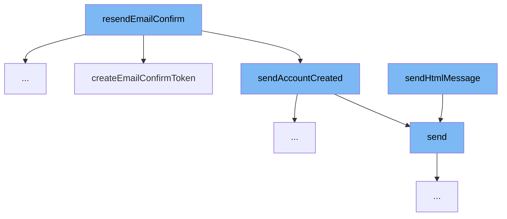

This document will cover the process of resending email confirmation in the MyHome project. We'll cover:

1. The initiation of the resend email confirmation process
2. The creation of the email content
3. The sending of the email



<SwmSnippet path="/service/src/main/java/com/myhome/services/springdatajpa/UserSDJpaService.java" line="152">

---

# The initiation of the resend email confirmation process

The `resendEmailConfirm` function is the entry point for the process. It checks if the user's email is confirmed. If not, it creates a new email confirmation token, removes any existing unused email confirmation tokens, and saves the user.

```java
  public boolean resendEmailConfirm(String userId) {
    return userRepository.findByUserId(userId).map(user -> {
      if(!user.isEmailConfirmed()) {
        SecurityToken emailConfirmToken = securityTokenService.createEmailConfirmToken(user);
        user.getUserTokens().removeIf(token -> token.getTokenType() == SecurityTokenType.EMAIL_CONFIRM && !token.isUsed());
        userRepository.save(user);
        boolean mailSend = mailService.sendAccountCreated(user, emailConfirmToken);
        return mailSend;
      } else {
        return false;
      }
    }).orElse(false);
  }
```

---

</SwmSnippet>

<SwmSnippet path="/service/src/main/java/com/myhome/services/springdatajpa/MailSDJpaService.java" line="59">

---

# The creation of the email content

The `sendAccountCreated` function is called next. It prepares the email content, including the username and email confirmation link, and then sends the email.

```java
  public boolean sendAccountCreated(User user, SecurityToken emailConfirmToken) {
    Map<String, Object> templateModel = new HashMap<>();
    String emailConfirmLink = getAccountConfirmLink(user, emailConfirmToken);
    templateModel.put("username", user.getName());
    templateModel.put("emailConfirmLink", emailConfirmLink);
    String accountCreatedSubject = getLocalizedMessage("locale.EmailSubject.accountCreated");
    boolean mailSent = send(user.getEmail(), accountCreatedSubject,
        MailTemplatesNames.ACCOUNT_CREATED.filename, templateModel);
    return mailSent;
  }
```

---

</SwmSnippet>

<SwmSnippet path="/service/src/main/java/com/myhome/services/springdatajpa/MailSDJpaService.java" line="90">

---

# The sending of the email

The `send` function is responsible for creating the HTML body of the email and calling `sendHtmlMessage` to send the email.

```java
  private boolean send(String emailTo, String subject, String templateName, Map<String, Object> templateModel) {
    try {
      Context thymeleafContext = new Context(LocaleContextHolder.getLocale());
      thymeleafContext.setVariables(templateModel);
      String htmlBody = emailTemplateEngine.process(templateName, thymeleafContext);
      sendHtmlMessage(emailTo, subject, htmlBody);
    } catch (MailException | MessagingException mailException) {
      log.error("Mail send error!", mailException);
      return false;
    }
    return true;
  }
```

---

</SwmSnippet>

&nbsp;

*This is an auto-generated document by Swimm AI 🌊 and has not yet been verified by a human*

<SwmMeta version="3.0.0" repo-id="Z2l0aHViJTNBJTNBbXlob21lJTNBJTNBc3dpbW1pbw==" repo-name="myhome"><sup>Powered by [Swimm](/)</sup></SwmMeta>
